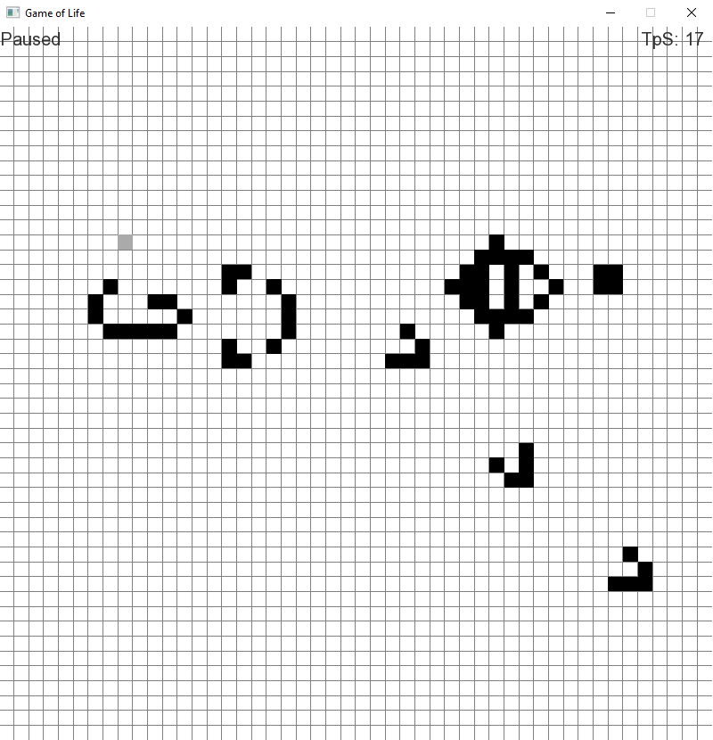

# GameOfLife
A small version of Conways Game of Life written in c++ using sfml

You can navigate the field using WASD or the arrow keys, and zoom in and out with the mouse wheel.
To add or remove a cell simply click on the field while the simulation is paused.
Use the space button to pause or unpause the simulation.

To increase or decrease the Ticks per Second counter (top-right corner) use the Q and E button.
Clear the field from all cells using ENTER.
